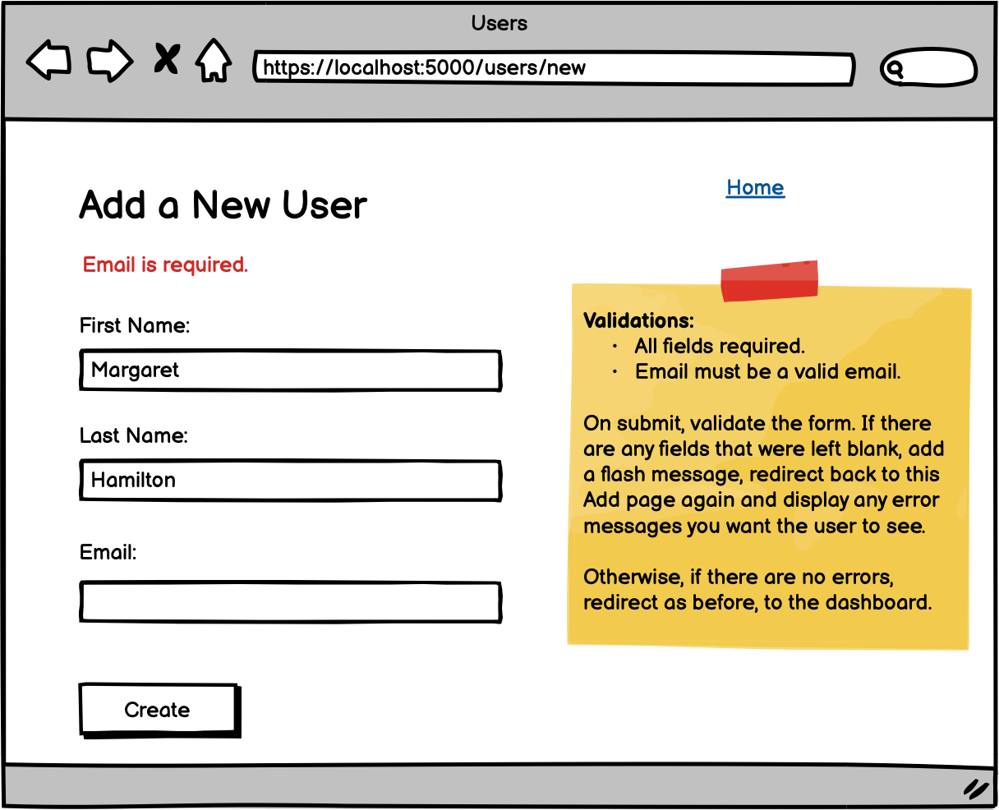

# ASSIGNMENT TITLE
This is a web-app created with Flask and MySQL to practice validation of user form input.
### Objectives:
* Add the following to your Users assignment: a validator method to your user class that takes in input data as a dictionary, adds flash messages and returns true or false.
* Validate that there are no fields left blank
* Validate that the email is in the correct format
* Be sure to add messages to flash if there are any errors.
* Handle the following logic in your controller: If invalid, send the user back to the create page and show the error messages in the page. If * valid, carry on creating the new user and redirect to the dashboard.
* Also validate that the email being added is unique
## I was given this wireframe as a reference:
